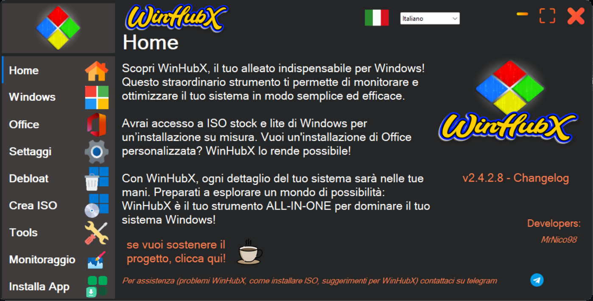

# WinHubX
## Introduction 🌟

WinHubX is a versatile open source tool designed to optimize and manage Windows operating systems.

WinHubX is constantly updated to include new features and improvements, making it an indispensable tool for those who want to optimize their Windows experience.

WinHubX was born from the original idea of ​​**mrnico98**

### Language 🖥️

## License 📄
WinHubX is distributed under the [GNU General Public License v3.0](https://www.gnu.org/licenses/gpl-3.0.html), allowing users the freedom to run, study, share, and modify the software.

### Site:

YourLifeUpdate: https://www.yourlifeupdated.net/programmi-windows/scaricare-iso-di-windows-e-office-gratis-con-winhubx

UIBlog: https://www.uiblog.it/2024/04/winhubx-un-toolbox-tuttofare/

GuruHitech: https://guruhitech.com/winhubx-il-super-wizard-che-scarica-windows-office-e/
